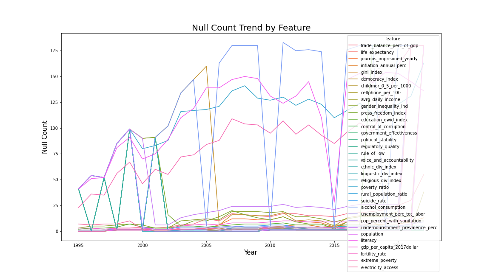

# Problem Statement
---

Corruption is a form of dishonesty or a criminal offense undertaken by a person or an organization entrusted with a position of authority. In this project, we will use data published by the Transparency International Organization, which compiles the corruption perception index for different countries worldwide. The objective is to explore whether these numbers correlate with other information about those countries. The information used to predict the corruption index includes, but is not limited to: wealth of the country, political indicators, press freedom, levels of education, unemployment, gender inequality, general healthcare and wellness indicators, quality of life, ethnic and religious divisions, and social norms.

For the modeling part, we employed linear regression (with and without principal component reduction), clustering, and classification. Depending on the model and objectives, different metrics such as R-squared (for regression problems), Silhouette score (for clustering), and precision and recall scores (for classification cases) were used for model evaluation purposes. Our models and metrics have shown promising results in modeling corruption in different countries, where R-squared scores, accuracy, and recall scores for the best-performing models are in the range of 0.95.

Being able to model the corruption index is important because, usually, it is not something most countries collaborate on for conducting surveys or related data collection methods. Additionally, modeling and predicting corruption could impact the economic growth of a country by increasing costs, lowering productivity, and influencing the investment risks in that country. Moreover, understanding the factors correlated with corruption in a country could help us delve deeper into the roots of why corruption happens in certain regions and what could be done to remedy this issue.

# Data Collection
---

Possible corruption indicators, along with the target variable corruption perception index, were collected from several sources (see data dictionary). Each feature dataset was formatted by country per year. Once data was collected, it was compiled into a single sheet for data cleaning, EDA, and modeling.

Data Dictionary

### Feature
| **country** | *object* | All Datasets | Country |
| --- | --- | --- | --- |
| **iso** | *object* | All Datasets | Country ISO abbreviation |
| **year** | *int64* | All Datasets | Year data was collected |
| **CPI** | *float64* | Corruption Perception Index (CPI) (0 to 100) | Transparency International's score of perceptions of corruption. Higher values indicate less corruption (source: Transparency International) |
| **childmor_0_5_per_1000** | *float64* | Child mortality (0-5 year-olds dying per 1000 born) | Death of children under five years of age per 1,000 live births (source: gapminder.org) |
| **avrg_daily_income** | *float64* | Average daily income, $/person/day, inflation- & price-adjusted | Mean daily household per capita income or consumption expenditure from the survey expressed in 2017 PPP (source: gapminder.org) |
| **life_expectancy** | *float64* | Life expectancy, at birth | The number of years a newborn infant would live if the current mortality rates at different ages were to stay the same throughout its life (source: gapminder.org) |
| **cellphone_per_100** | *float64* | Cell phones (per 100 people) | Mobile cellular telephone subscriptions to a public mobile telephone service per 100 people (source: gapminder.org) |
| **trade_balance_perc_of_gdp** | *float64* | Trade balance (% of GDP) | Exports of goods and services minus imports of goods and services (source: gapminder.org) |
| **inflation_annual_perc** | *float64* | Inflation (annual %) | Inflation as measured by the annual growth rate of the GDP (source: gapminder.org) |
| **gini_index** | *float64* | Gini coefficient | Gini shows income inequality in a society. A higher number means more inequality (source: gapminder.org) |
| **democracy_index** | *float64* | Democracy index (EIU) | Index is using the data from the Economist Intelligence Unit to express the quality of democracies as a number between 0 and 100 (source: gapminder.org) |
| **journos_imprisoned_yearly** | *float64* | Representative Government Index (IDEA) | Number of journalists imprisoned in a given year (source: gapminder.org) |
| **control_of_corruption** | *float64* | Control of Corruption (-2.5 to 2.5) | Control of Corruption captures perceptions of the extent to which public power is exercised for private gain, including both petty and grand forms of corruption, as well as the "capture" of the state by elites and private interests. Estimate gives the country's score on the aggregate indicator (source: World Bank) |
| **government_effectiveness** | *float64* | Government Effectiveness (-2.5 to 2.5) | Government Effectiveness captures perceptions of the quality of public services, the quality of the civil service and the degree of its independence from political pressures, the quality of policy formulation and implementation, and the credibility of the government's commitment to such policies (source: World Bank) |
| **political_stability** | *float64* | Political Stability and Absence of Violence (-2.5 to 2.5)/Terrorism | Political Stability and Absence of Violence/Terrorism measures perceptions of the likelihood of political instability and/or politically-motivated violence, including terrorism (source: World Bank) |
| **regulatory_quality** | *float64* | Regulatory Quality (-2.5 to 2.5) | Regulatory Quality captures perceptions of the ability of the government to formulate and implement sound policies and regulations that permit and promote private sector development (source: World Bank) |
| **rule_of_law** | *float64* | Rule of Law (-2.5 to 2.5) | Rule of Law captures perceptions of the extent to which agents have confidence in and abide by the rules of society, and in particular the quality of contract enforcement, property rights, the police, and the courts, as well as the likelihood of crime and violence (source: World Bank) |
| **voice_and_accountability** | *float64* | Voice and Accountability (-2.5 to 2.5) | Voice and Accountability captures perceptions of the extent to which a country's citizens are able to participate in selecting their government, as well as freedom of expression, freedom of association, and a free media (source: World Bank) |
| **ethnic_div_index** | *float64* | Ethnic Division Index (0 to 1) | An index to compare the level of ethnic fractionation in a country (source: Wikipedia) |
| **linguistic_div_index** | *float64* | Linguistic Division Index (0 to 1) | An index to compare the level of linguistic fractionation in a country (source: Wikipedia) |
| **religious_div_index** | *float64* | Religious Division Index (0 to 1) | An index to compare the level of religious fractionation in a country (source: Wikipedia) |
| **education_owid_index** | *float64* | Education Index (starts from 0) | Education index calculated based on average years of schooling (source: gapminder) |
| **press_freedom_index** | *float64* | Freedom of Press | An index to represent the freedom of speech and press in each country (source: Reporters Without Borders) |
| **poverty_ratio** | *float64* | Poverty headcount ratio at national poverty line (% of population) | National poverty headcount ratio is the percentage of the population living below the national poverty line(s) (source: World Bank) |
| **rural_population_ratio** | *float64* | Rural population (% of total population) | Rural population refers to people living in rural areas as defined by national statistical offices. It is calculated as the difference between total population and urban population. Aggregation of urban and rural population may not add up to the total population because of different country coverages (source: World Bank) |
| **suicide_rate** | *float64* | Suicide mortality rate (per 100,000 population) | Suicide mortality rate is the number of suicide deaths in a year per 100,000 population. Crude suicide rate (source: World Bank) |
| **alcohol_consumption** | *float64* | Total alcohol consumption per capita (liters of pure alcohol, projected estimates, 15+ years of age) | Total alcohol per capita consumption is defined as the total (sum of recorded and unrecorded alcohol) amount of alcohol consumed per person (15 years of age or older) over a calendar year, in liters of pure alcohol, adjusted for tourist consumption (source: World Bank) |
| **unemployment_perc_tot_labor** | *float64* | Unemployment, total (% of total labor force) | Unemployment refers to the share of the labor force that is without work but available for and seeking employment (source: World Bank) |
| **gender_inequality_ind** | *float64* | Gender Inequality Index | The gender inequality index (GII) provides insights into gender disparities in health, empowerment, and the labor market. Higher values in the GII indicate worse achievements. The Gender Inequality Index is a composite measure reflecting inequality in achievements between women and men in three dimensions: reproductive health, empowerment, and the labor market (source: World Health Organization) |
| **gdp_per_capita_2017dollar** | *float64* | GDP | Gross domestic product in 2017 dollars (source: ourworldindata.org) |
| **fertility_rate** | *float64* | Births | Measured by average births per woman (source: ourworldindata.org) |
| **undernourishment_prevalence_perc** | *float64* | Calorie deficit | Percentage of the population with a calorie deficit (source: ourworldindata.org) |
| **electricity_access** | *float64* | Electricity | Percentage of the population with access to electricity (source: ourworldindata.org) |
| **pop_percent_with_sanitation** | *float64* | Sanitation | Percentage of the population using at least basic sanitation (source: ourworldindata.org) |

# Methodology and Modeling
---

The target variable, corruption perception index, was collected and formatted to merge with the feature variables. Given the large number of individual datasets from various sources, the compiled dataset had a large number of nulls that needed to be reconciled (see figure below). A null trend chart was created to illustrate how many nulls each feature had per year. Using this chart to optimize feature selection and choose the best time frame, a dataframe was created where there was minimal data loss when `dropna()` was applied.

Heat maps were then used on this 'no_null' dataset to reduce overlap between the target variable and highly correlated features such as control_of_corruption. Additionally, the least CPI correlated feature, in feature pairs with correlations higher than 0.90, was dropped. The resulting dataset includes 20 features. Once collinearity was sufficiently reduced, linear regression was applied to the production dataset to obtain coefficients and an R2 test score of 0.835.

To improve predictability performance, the production dataset was put through four regression models: Ridge, Lasso, KNeighbors, and RandomForest. Ridge and Lasso performed similarly to Linear Regression, but KNeighbors and Random Forest performed well with test scores of 0.972 and 0.975, respectively. The best two models were boosted for further performance improvement; KNeighbors boosted performed essentially the same as non-boosted, but RandomForest test score improved to 0.981. Stacking, then boosting/stacking, RandomForest did not improve on prediction performance.

Other weaker models included PCA, which achieved a maximum score of 0.83 when it used all 20 available features and a score of 0.73 when it used the elbow value of 4 components.

# Conclusions
---

EDA shows a strong correlation between some factors like political and economic features and CPI. The overall trend of how CPI changes with time does not indicate significant effort from countries to fight corruption. Our classification model shows promising performance in minimizing false negative responses when identifying countries with a high risk of corruption. The three most heavily weighted features were avrg_daily_income, democracy_index, fertility_rate. Clustering analysis on these features with CPI showed that these features are geographically clustered as well, meaning a country’s level of corruption has predictive power on the corruption index of neighboring countries. Boosted RandomForest was the best-performing model/technique for predicting CPI scores with a score of 0.981.

# Future Recommendations
---

Investigate if further feature reduction can be achieved without sacrificing model performance. This may be possible with other transformers, i.e., PolynomialFeatures, or utilizing Recurrent Neural Networks. Also, doing some sort of natural language processing analysis on countries' lawbook might have some explanatory power for CPI.

